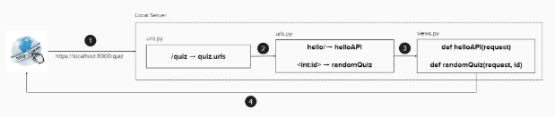

# 설명

주어진 개수만큼 랜덤한 퀴즈 문제와 답을 반환하는 API

# 사용법

1. Python 설치
2. manage.py가 있는 디렉터리에서 `python manage.py runserver`
3. API 설계 참고(또는 urls.py 참고)하여 url 입력하여 json 결과 확인
4. admin/ 을 통한 모델 관리


# REST API 구조

```
quiz/
	|-- hello/
	|-- (문제개수)/
```


# 서비스 흐름



1. 웹 브라우저 주소창에 localhost:8000/quiz 입력(장고 개발 서버에 /quiz 페이지 요청)
2. /[project_name]/urs.py 파일에서 URL을 해석해서 quiz.urls 이동
3. quiz.urls.py 파일에서 `quiz/` 아래에 붙은 url 에 따라 quiz.views.py 의 함수 호출
4. quiz.views.py 파일의 함수를 실행하고 그 결과를 웹 브라우저에 전달.

사용자가 /quiz 페이지를 요청하면 장고 개발 서버가 URL을 분석해, URL에 매핑된 함수를 호출하고, 함수 실행 결과를 웹 브라우저 화면에 전달한다.

# 작업 순서

1. 가상환경 구성 및 DRF 설치
2. 장고 프로젝트 생성
3. APP 생성
4. settings.py
    - ALLOWED_HOSTS=['*']: 모든 접근에 대해서 허용
    - TIME_ZONE
    - STATIC_ROOT
    - INSTALLED_APPS 에 'rest_framework', 생성한 app 추가
5. 서버 정상 동작 확인
    - python manage.py runserver
6. models.py
7. serializers.py
8. views.py
9. 프로젝트 urls.py
10. App urls.py
